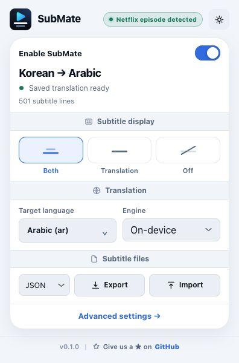
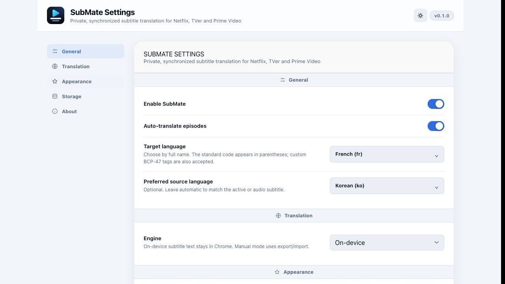

# SubMate

**Private, synchronized subtitle translation for Netflix, TVer and Prime Video in Chrome.**

[](https://github.com/ghassenbrg/SubMate/actions/workflows/ci.yml)
[](https://github.com/ghassenbrg/SubMate/actions/workflows/pages.yml)
[](LICENSE)

SubMate is an independent Manifest V3 browser extension that translates streaming text subtitles on-device, caches the result locally, and renders it against the original cue timing.

**Website:** [submate.ghassen.io](https://submate.ghassen.io/) · **Documentation:** [installation](https://ghassenbrg.github.io/SubMate/installation.html), [features](https://ghassenbrg.github.io/SubMate/features.html), [configuration](https://ghassenbrg.github.io/SubMate/configuration.html), [privacy](https://ghassenbrg.github.io/SubMate/privacy.html) · **Releases:** [GitHub Releases](https://github.com/ghassenbrg/SubMate/releases) · **Chrome Web Store:** [listing coming soon](https://chromewebstore.google.com/)

It has no SubMate account, no backend, no analytics, and no bundled API key. With the default on-device engine, subtitle text never leaves your browser.

Supported platforms are **Netflix**, **TVer** and **Amazon Prime Video**, each implemented as a platform adapter over a shared translation, caching, synchronization and rendering core. See [Architecture](docs/ARCHITECTURE.md).

> SubMate is not affiliated with, endorsed by, or sponsored by Netflix, TVer or Amazon.

## Highlights

- Translates with Chrome's built-in on-device Translator API; subtitle text stays in the browser.
- Optionally translates through a cloud model with your own API key — Gemini, ChatGPT, Claude, Mistral, DeepSeek, Grok, Groq, OpenRouter, or any OpenAI-compatible server including self-hosted ones — for higher-quality, context-aware output. Opt-in, never the default, and it sends subtitle text to the provider you choose — see [Cloud translation](docs/CLOUD_TRANSLATION.md).
- Reads TTML/DFXP and WebVTT tracks, preserves cue timing, and offers bilingual, translation-only, and off display modes.
- Caches source subtitles and translations in IndexedDB, so reloads and episode changes recover instantly.
- Renders a synchronized, fullscreen-aware, direction-aware overlay with adjustable appearance controls.
- Imports and exports SubMate JSON, SRT, and VTT with alignment validation, for language pairs Chrome cannot translate.
- Ships English, Japanese, Arabic (including RTL), and French interface localizations.
- Assembles TVer's segmented HLS WebVTT into one episode track, merging and de-duplicating across segments.
- Hides translated subtitles during advertisements and resynchronizes against content time afterwards.
- Requests only the host permissions it needs, never `<all_urls>`, and runs no telemetry or SubMate-operated server.

## Getting started

1. Open a supported title with text subtitles: Netflix, a caption-enabled TVer episode, or Prime Video.
2. Choose a target language in the SubMate popup.
3. Start translation from the popup or the in-player controls. Chrome downloads language data the first time a pair is used, then SubMate renders synchronized translated subtitles.

For a live testing checklist and the expected state for each step, see [Manual testing](docs/MANUAL_TESTING.md).

## Screenshots

Sanitized UI previews from the local extension harness. They do not include streaming-account, title, or regional catalog information.

<p align="center">
  
  
</p>

Contributions may include sanitized UI screenshots that follow the [contribution guide](CONTRIBUTING.md).

## Install

For the current installation flow, see the [website installation guide](https://ghassenbrg.github.io/SubMate/installation.html).

### Chrome (unpacked build)

1. Download and extract the Chrome ZIP from a [GitHub Release](https://github.com/ghassenbrg/SubMate/releases), or build it locally as described below.
2. Open `chrome://extensions` and enable **Developer mode**.
3. Select **Load unpacked**, then choose the extracted extension directory. For a local build that is `dist/chrome/`.
4. Pin SubMate, open a supported title, then choose a target language from the popup.

The packaged ZIP contains the extension files at its root, so extract it before using **Load unpacked**. It is also the file submitted to the Chrome Web Store.

## Requirements

SubMate targets **Google Chrome 138 or later on desktop** (macOS, Windows, Linux). Which language pairs are available, and whether a model must be downloaded first, is decided at runtime by Chrome's Translator API.

You need an active subscription for the service you are watching, and the title must carry a **text** subtitle track — image-based subtitles cannot be translated, and SubMate reports that explicitly rather than failing silently.

Firefox, Safari, mobile Chrome, and Edge are not current release targets. The build layout under `dist/` is prepared for additional targets.

## Usage

Choose a target language in the popup and select **Start translation**. When the service already provides subtitles in your target language, SubMate does not duplicate them.

Switch between bilingual, translation-only, and off from either the popup or the in-player controls. The options page covers source-language preference, subtitle appearance, cache management, and import/export.

Automatic translation only covers text tracks and language pairs Chrome supports. For anything else, export a translation package, translate it however you like, and import the completed file back.

## Development

### Prerequisites

- Node.js 20 or later (CI uses Node 22)
- npm 10 or later
- Google Chrome 138 or later for manual testing

### Setup

```sh
git clone https://github.com/ghassenbrg/SubMate.git
cd SubMate
npm ci
```

### Validate, build, and package

```sh
# Type-check and run the test suite
npm run check
npm test

# Create a production Chrome build
npm run build:chrome

# Confirm the built manifest and required files are release-safe
npm run validate:chrome

# Build, validate, and create a Chrome Web Store-ready ZIP
npm run pack:chrome
```

`npm run validate` runs the full local gate, and is what CI runs on every push and pull request. Production files are written to `dist/chrome/`; release ZIPs to `dist/packages/`.

## Project structure

```text
public/       Manifest, HTML, localization files, CSS, and icons
src/          Extension source code
  background/ Service worker
  content/    Platform-independent content-script orchestration
  platforms/  Netflix, TVer and Prime Video adapters plus the adapter registry
  core/       HLS parsing, segment merging, playback observation, retry
  page/       Page-realm media and manifest agents
  renderer/   Subtitle overlay and cue indexing
  subtitles/  Parsers, normalization, validation, and timing
  translation/ Translation providers and the translation manager
  ui/         Popup and options interfaces
scripts/      Build, validation, packaging, and tag checks
tests/        Unit, integration, fixture, and UI-harness tests
docs/         Technical, testing, and publishing documentation; icon artwork
.github/      CI and release workflows, contribution templates
website/      Official static documentation website deployed to GitHub Pages
```

`docs/icon.png` is the master artwork; the PNGs in `public/icons/` are resized from it. `public/icons/icon.svg` is a vector redraw used where a crisp scalable mark matters, and its glyph geometry is inlined by the in-player overlay.

## Releases and publishing

Releases carry matching `package.json` and manifest versions and are tagged `vX.Y.Z`. Pushing that tag runs type checks and tests, builds and validates `dist/chrome/`, creates a ZIP, uploads it to a GitHub Release, and can optionally upload it to the Chrome Web Store.

Read the complete [publishing HOWTO](HOWTO.md) before cutting a release, or use the shorter [publishing guide](docs/PUBLISHING.md) during routine work. The initial Chrome Web Store listing must be created manually; later updates can be automated once the required repository secrets and variables are configured.

The official documentation site is deployed automatically to [GitHub Pages](https://ghassenbrg.github.io/SubMate/) whenever `website/` changes on `main`. It is ready to move to `submate.ghassen.io` once DNS is configured; see [HOWTO.md](HOWTO.md#5-configure-github-pages-and-the-future-custom-domain).

## Contributing, support, and security

Contributions are welcome. Read [CONTRIBUTING.md](CONTRIBUTING.md) and the [Code of Conduct](CODE_OF_CONDUCT.md) for the development and review process. Use the issue templates for bugs and feature requests; for general help see [SUPPORT.md](SUPPORT.md).

Report suspected vulnerabilities privately as described in [SECURITY.md](SECURITY.md) rather than opening a public issue.

## License

SubMate is released under the [MIT License](LICENSE).
